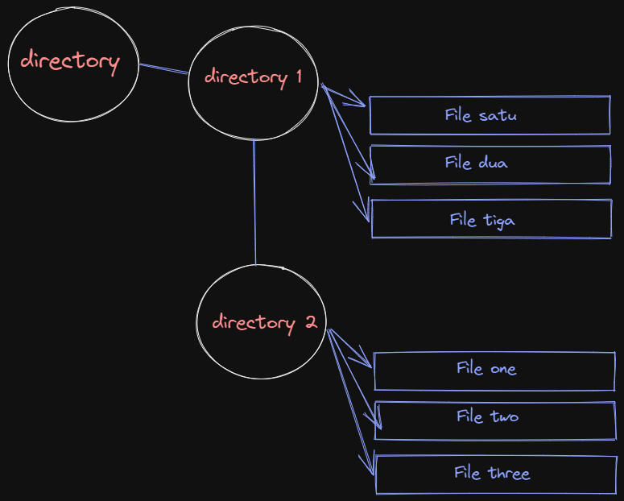

# Unix Command Line

1. <b>Shell</b> yang digunakan untuk berinteraksi antara pengguna dengan perangkat lunak / software dan sistem operasi dengan cara mengetikkan perintah ke dalam interface dan dapat menerima respons.

2. <b>Command Line Interface</b> merupakan Interface atau antarmuka berbasis teks, CLI tersebut bisa berupa GUI atau shell. CLI memiliki contoh seperti: <br>
    - bash <br>
    - sh <br>
    - zsh <br>
    - cmd.exe / Command Prompt

3. <b>Cara mengakases CLI dengan menggunakan terminal </b> yang umum dipakai adalah Command Prompt, lalu ada juga yang menggunakan Bash seperti saya. Berikut adalah tampilan awal saat membuka Command Prompt atau Bash :<br>  <br>

4. **System Structur** dengan menyimpan semua perubahan pada directory atau file project yang dibuat oleh pengguna dan diatur dalam system tersebut. File yang sudah disimpan maka akan tersusun dengan bentuk hirarki atau tree. Contohnya : 

5. **Print working directory** atau `pwd` digunakan untuk menampilkan current working directory.
6. **Lists** `ls` digunakan untuk melihat isi file yang ada di sebuah directory.
7. **Change Directory** `cd nama_file_directory` digunakan untuk berpindah ke directory lain.
8. **Cat** `cat nama_file` digunakan untuk menampilkan isi dari file tersebut.
9. **Head** `head nama_file` digunakan untuk menampilkan beberapa line awal dari isi file.
10. **Tail** `tail nama_file` digunakan untuk menampilkan beberapa line awal dari bawah isi file tersebut.
11. **Touch** `touch nama_file` digunakan untuk membuat file baru.
12. **Make directory** `mkdir nama_directory` digunakan untuk membuat directory baru.
13. **Copy** `cp nama_file` digunakan untuk menyalin file. `cp -R nama_directory` digunakan untuk menyalin directory.
14. **Move** `mv nama_file` digunakan untuk memindahkan file. `mv -R nama_directory` digunakan untuk memindahkan directory. `mv nama_file_lama nama_file_baru` digunakan untuk mengubah nama file.
15. **Remove** `rm nama_file` digunakan untuk menghapus file. `rm -R nama_directory` digunakan untuk menghapus directory.

# Git and Github

1. **Git dan Github** merupakan tools yang dimiliki banyak programmer yang digunakan untuk menyimpan file project yang sedang dikerjakan. **Git** ini juga bisa digunakan untuk melacak perubahan apa saja yang terjadi dalam suatu file project. **Github** sebagai forum diskusi para programmer seperti halnya media sosial, dan merupakan layanan cloud yang memiliki kegunaan sama untuk menyimpan dan mengelola sebuah project yang dinamakan repository (repo git).
2. Perbedaan Git dan Github :
<table>
    <tr>
    <th></th>
    <th>Git</th>
    <th>Github</th></tr>
    <tr>
    <th>1.</th>
    <td>Meng-install software di penyimpanan lokal</td>
    <td>Host melalui layanan cloud</td></tr>
    <tr>
    <th>2.</th>
    <td>Dikelola oleh The Linux Foundation</td>
    <td>Diakuisisi oleh Microsoft pada 2018</td></tr>
    <tr>
    <th>3.</th>
    <td>Berfokus pada version control dan code sharing</td>
    <td>Berfokus pada source code hosting terpusat</td></tr>
    <tr>
    <th>4.</th>
    <td>Akses secara offline</td>
    <td>Akses secara online</td></tr>
    <tr>
    <th>5.</th>
    <td>Tidak menggunakan fitur user management</td>
    <td>Menggunakan user management</td></tr>
    <tr>
    <th>6.</th>
    <td>Menyediakan desktop interface bernama “Git GUI”</td>
    <td>Menggunakan nama desktop interface “GitHub Desktop”</td></tr>
    <tr>
    <th>7.</th>
    <td>Bersaing dengan Mercurial, Subversion, IBM, Rational Team, Concert, dan ClearCase</td>
    <td>Bersaing dengan GitLab dan Atlassian BitBucket</td></tr>
    <tr>
    <th>8.</th>
    <td>Open sourced licensed</td>
    <td>Pilihan bagi pengguna gratis dan pengguna berbayar</td></tr>
</table><br>

3. Alur kerja Git dan Github <br> 
4. `git init nama_directory` command ini akan membuat directory dan file `.git` sebagai tempat memori penyimpanan. Lalu jika sudah ada directory maka hanya memerlukan command `git init .` pada tempat directory yang sudah dibuat sebelumnya.
5. Melakukan commit pada Git <br>
    <br> Setelah membuat file maka kita git add dulu supaya masuk ke stage area setelah itu git status. Jika file sudah berwarna hijau, selanjutnya membuat command `git commit -m "Cara melakukan commit pada git, membuat file index.js dan oke.html"` ini contoh aku ambil pada saat saya sedang praktek, dan nanti bisa sesuai kasusnya masing-masing. Setelah itu `git log` untuk melihat checkpoint yang sudah di commit.

6. Publish ke Github<br>
    <br>
   Sebelum di push, yang dilakukan adalah membuat repository dulu di Github dengan nama yang sama. Lalu ceklist public supaya bisa dilihat teman satu tim atau orang lain, setelah itu create repository. Setelah sukses membuat repository yng dilakukan adalah copy command yang disediakan dan paste di Git bash. Setelah itu copy command `git push -u origin master`. Setelah itu masuk ke web Github kita cek dan refresh, maka tampilan nya seperti di bawah ini.
    <br>

7. Cara Clone ke local <br>
   <br>
   Masuk ke Github, lalu pilih tombol **Code** warna hijau dan copy link nya. Setelah itu masuk ke file explorer mencari tempat dimana akan diletak kan file repository tersebut. Setelah itu klik kanan pilih Git Bash Here, lalu masukkan command `git clone link_clone_github` maka tampilan seperti di bawah ini. <br>
   <br><br>

# HTML Dasar

1. HTML (Hypertext Markup Language) yang berfungsi menampilkan konten di browser dan menjadi kerangka awal untuk pembuatan web.
2. Tools yang dibutuhkan untuk untuk membuat HTML yaitu web browser dan code editor seperti Visual Studio Code, Sublime Text, dll.
3. Contoh HTML sederhana
   ``` HTML
       <!DOCTYPE html>
       <html lang="en">
       <head>
            <meta charset="UTF-8">
            <meta http-equiv="X-UA-Compatible" content="IE=edge">
            <meta name="viewport" content="width=device-width, initial-scale=1.0">
            <title>Skilvul week 1</title>
       </head>
       <body>
           <h1>Rifaldo Rezha Saputra</h1>
       </body>
       </html>
   ``` 
    <br>
4. Tampilan menjalankan html sederhana seperti dibawah ini.
    <br>
    <br>
    Tampilan menjalankan dengan ekstensi Live Server seperti dibawah ini.<br>
    

5. Implementasi tag HTML yang sering digunakan. <br>
    * HTML Element terdiri atas opening tag, content, dan closing tag. <br>
        - Opening Tag : ``<p>`` <br>
        - Content : ``Hello World`` <br>
        - Closing Tag : ``</p>`` <br>
    * HTML Attributes : properties dari sebuah element HTML, contohnya yaitu ``id,class,name``<br>
    * Single Tag atau singular tag<br>
        - ``<br/>``<br>
        - ``<hr/>`` <br>
        - ```` <br>
    * Paired Tag atau double Tag <br>
        - ``<h1> </h1>`` <br>
    * HTML Comment digunakan untuk memberi keterangan pada suatu line code, Opening command ``<!--`` Closing Command ``-->``.
6. Semantic HTML<br>
    ``` HTML
        <body>

          <header>
            <h1>My web</h1>
            </header>

            <nav>
                <a href="#">Home</a> |
                <a href="#">Profile</a> |
                <a href="#">Log out</a>
                </nav>

            <article>
                <h1>Selamat Datang!</h1>
                <p>Saya, Rifaldo Rezha Saputra. Dari, Universitas Merdeka Madiun. Jurusan Manajemen Informatika. </p>
              </article>

            <footer> Copyright &copy; by reza </footer>

            </body>

    ```
7. Pertama Masuk ke suatu web bernama netlify yang digunakan para programer untuk mem publish website mereka. Lalu login dengan email atau di tautkan dengan akun Github. Selanjutnya authorized ke akun Github, pilih repository yang akan di publish, dan lakukan konfigurasi. Lalu tunggu proses nya sampai selesai.


# CSS Dasar

1. CSS (Cascading Style Sheets) yang digunakan untuk mendesain halaman website dengan mengubah warna, menggunakan font custom, editing text format, mengatur tata letak.
2. Ada 3 cara menggunakan CSS yaitu : <br>
    - __Inline Tag__ : menggunakan css langsung di atribute element html. <br>
    - __Internal Tag__ : menggunakan tag style di bagian head. <br>
    - __External Tag__ : menggunakan file css terpisah dengan html. <br>

3. Sintaks dasar CSS ada 3 yaitu Selektor, Blok Deklarasi, Properti dan Nilai.<br> 
    ``h1{ background-color: yellow; } ``
4. Styling CSS 
    ``` CSS
        body {
          background-color: lightblue;
          color: #ffffff;
        }
        text {
          text-align: left;
        }
        p {
          font-size: 16px;
        }
        
    ```
5. Menggunakan media responsive
    ```css
        @media only screen and (max-width: 600px) {
          body {
            background-color: lightblue;
          }
        }
    ```
6.Penggunaan Flexbox <br>
- __Flexbox__ adalah suatu cara untuk mengatur layout atau tata letak, yang terdiri 1 parent (container) dan bisa beberapa child. <br>
- __Flex direction__ digunakan untuk mengatur letak child. <br>
- __Flex wrap__ mengatur tata letak child pada 1 line. <br>
- __Flex flow__ yaitu digunakan sebagai shortcut untuk set up flex-direction dan flex-wrap secara bersamaan. <br>
- __Order__ digunakan untuk ordering item yang ingin diatur posisinya. <br>
- __Justify - content__ digunakan untuk mengatur tata letak antar item child secara horizontal. <br>
- __Align - content__ digunakan untuk mengatur tata letak antar item child secara vertikal atau cross axis. <br>
- __Flex-grow__ digunakan untuk mengatur size suatu item child pada flexbox. <br>
- __Flex-shrink__ digunakan untuk memperkecil size suatu item child secara relatif terhadap item child lainnya. <br>
- __flex-basis__ digunakan untuk mengatur width setiap item child. <br>

# Algorithm & Data Structures

1. __Algoritma__ merupakan deskripsi berupa step-step yang dibutuhkan untuk menyelesaikan suatu masalah. __Data Structure__ merupakan cara menyimpan dan mengelola data di dalam komputer.

2. Manfaat penggunaan algortima dan data structur adalah karena algoritma dapat membantu manyusun langkah - langkah untuk menyelesaikan suatu masalah. Dan data structur ini adalah programming yang digunakan untuk mengelola/manajemen sebuah data yang telah disusun secara algoritma tadi.
3. Algoritma sederhana dalam bahasa pemrograman javascript.
    ```javascript
        let angka = 2;
        let hasil;

        hasil = angka * 5;
        console.log(hasil);
    ```

4. __Big O__ sebuah cara atau metode untuk melakukan analisa terhadap sebuah algoritma pemrograman terhadap waktu eksekusi. Mencari jalan alternatif untuk mempermudah lagi jalan nya program yang semakin besar di waktu kedepan.

5. Jika ada data untuk mengeluarkan pesan banyak misal 100 output pesan dan membutuhkan waktu atau tenaga yang lebih, jadi penggunaan looping adalah solusi yang bagus.

6. Penerapan struktur data __Array__ dengan javascript.
    ```javascript
        let nama = ["rifaldo", "reza", "saputra"];
        let a;

        for(a = 2; 0 <= a; a--){
        console.log("aku adalah " + nama[a]);
        }
    ```

# JavaScript Dasar Introduction
1. __JavaScript__ merupakan bahasa pemrograman yang digunakan untuk membuat web menjadi lebih interaktif dan responsive.

2. Untuk menjalankan javascript pada umumnya menggunakan web browser seperti Chrome, Microsoft Edge, Mozila Firefox, kalau pakai code editor Visual Studio Code bisa di bagian console.

3. Macam - macam Tipe Data di JavaScript :
    - __Number__ : tipe data yang mengandung semua jenis angka. Tipe data number ada 2 macam yaitu integer (terdiri dari bilangan bulat positif atau negatif) dan float (terdiri dari bilangan desimal).
    - __String__ : tipe data yang terdiri dari huruf, angka, spasi maupun simbol Tipe data string.
    - __Boolean__ : tipe data yang memiliki nilai true or false.
    - __Null__ : tipe data pada sebuah data/variabel yang tidak memiliki nilai.
    - __Undefined__ : tipe data yang merepresentasikan varibel/data yang tidak memiliki nilai.
    - __Object__ : tipe data yg dapat berisi berbagai nilai dan berhubungan dengan dunia nyata.
4. Operator digunakan untuk menyimpan sebuah nilai pada variabel. __Contoh__ `` let saya = "Reza"; `` jadi variabel data ``saya`` memiliki nilai string ``Reza``. Dengan Operator Math perkalian ``*``
    ```javascript
        let angka = 6;
        let hasil = angka * 4;
        console.log(hasil); // 24    
    ```
5. __Conditional__ merupakan statement percabangan yang menggambarkan suatu kondisi, statement akan mengecek kondisi spesifik dan menjalankan perintah berdasarkan kondisi tersebut. Yang dicek adalah apakah kondisi tersebut TRUE (benar). Jika TRUE maka code didalam kondisi tersebut dijalankan. Kondisi tersebut bisa menggunakan ``IF, IF.. Else, IF.. Else if Statement``.
__Looping__ adalah statement yang mengulang atau perulangan sebuah instruksi hingga kondisi terpenuhi atau jika kondisi stop atau berhenti tercapai. Misal menggunakan perulangan ``For Loop`` contoh statement 
    ```JavaScript
        for(let a = 1; a <= 10; a++){
        console.log(a); // 1 2 3 4 5 6 7 8 9 10
        } 
    ```
    Jadi kode di atas saat ``a = 1`` lalu ``a kurang dari sama dengan(<=) 10)`` maka ``a +1 (a++)``. Lalu ditampilkan dengan ``console.log(a)``.<br>

# JavaScript Dasar Scope and Function

1. __Scope__ adalah konsep dalam flow data variabel, yang menentukan suatu variabel bisa diakses pada scope tertentu atau tidak, scope memiliki lingkup sifat global dan local. Kalau sifat global itu bisa lebih luas daripada local. 

2. __Function__  merupakan sebuah blok kode dalam sebuah grup untuk menyelesaikan 1 task/1 fitur. Saat kita membutuhkan fitur tersebut nantinya, kita bisa kembali menggunakannya. 
    ``` JavaScript
        function hasilLooping(){
            for(let a = 1; a <= 10; a++){
              console.log(a);
            }
        }
        
        hasilLooping(); // 1 2 3 4 5 6 7 8 9 10
    ``` 
    <br>
3. Hal pertama koreksi kode apakah ada yang salah, jika merasa tidak ada terus di run ada, jika ada eror maka kita baca dan pahami isi (dalam) pesan kesalahan yang muncul di konsol Anda (web browser, terminal, atau apa pun yang digunakan). Jenis - jenis kesalahan yang sering ditemui : <br>
     - Kesalahan referensi <br>
         &ensp; Merupakan hal yang umum ketika menggunakan const dan let, mereka diangkat seperti var dan function tetapi ada waktu antara pengangkatan dan dideklarasikan sehingga ketika mencoba mengaksesnya terjadi kesalahan referensi.
     - Kesalahan sintaks <br>
         &ensp; Kesalahan ini seperti mengirim tanda koma saat memanggil fungsi ditangani tanpa kesalahan oleh sebagian besar browser terbaru, tetapi yang lebih lama harus berhati-hati.
     - Kesalahan salah ketik <br>
         &ensp; Muncul ketika jenis (angka, string, dan sebagainya) yang digunakan atau akses tidak kompatibel, seperti mengakses properti dalam jenis variabel yang tidak ditentukan. Cara mengatasinya sederhana, pastikan bilah itu ada sebelum mencoba mengaksesnya, baik dengan membuat bilah atau dengan memeriksa _undefined_.

# JavaScript Dasar Data Type Built in Prototype & Method

1. __Data Type__ untuk dapat beroperasi pada variabel, penting untuk mengetahui sesuatu tentang tipenya yang diinputkan.
2. __String__ digunakan untuk mewakili data tekstual. Ini adalah satu set "elemen" dari nilai integer 16-bit unsigned. Setiap elemen dalam String menempati posisi dalam String.
3. __Number__ merupakan yang memiliki satu jenis angka, yang dapat ditulis dengan atau tanpa desimal. 
4. __Math__  memungkinkan untuk melakukan tugas matematika pada angka/number.
5. __Primitive__ sudah ditentukan sebelumnya di java, yang selalu memiliki nilai diawali huruf kecil dapat juga tergantung pada tipe data nya. __Non Primitive__ dibuat oleh programmer dan tidak didefinisikan oleh Java (kecuali untuk String), digunakan untuk memanggil method dan untuk melakukan operasi tertentu yang dapat berupa nilai ``null``.


# <br>
