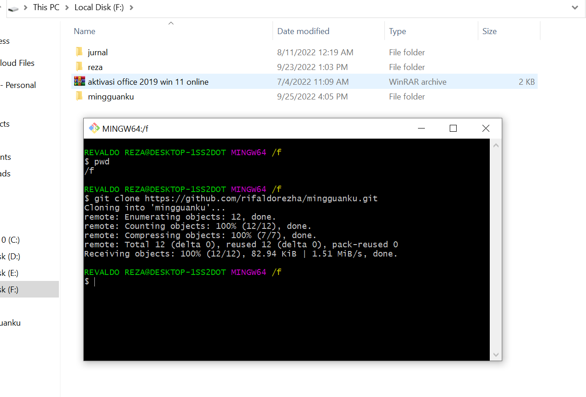

# Unix Command Line

1. <b>Shell</b> yang digunakan untuk berinteraksi antara pengguna dengan perangkat lunak / software dan sistem operasi dengan cara mengetikkan perintah ke dalam interface dan menerima respons.

2. <b>Command Line Interface</b> merupakan Interface atau antarmuka berbasis teks, CLI tersebut bisa berupa GUI atau shell. CLI memiliki contoh : <br>
   &ensp; - bash <br>
   &ensp; - sh <br>
   &ensp; - zsh <br>
   &ensp; - cmd.exe / Command Prompt

3. <b>Cara mengakases CLI dengan menggunakan terminal </b> yang umum dipakai adalah Command Prompt, lalu ada juga yang menggunakan Bash seperti saya. Berikut adalah tampilan awal saat membuka Command Prompt atau Bash :<br>  <br>

4. **System Structur** dengan menyimpan semua perubahan pada directory atau file project yang dibuat oleh pengguna dan diatur dalam system tersebut. File yang sudah disimpan maka akan tersusun dengan bentuk hirarki atau tree.

5. **Print working directory** atau `pwd` digunakan untuk menampilkan current working directory.
6. **Lists** `ls` digunakan untuk melihat isi file yang ada di sebuah directory.
7. **Change Directory** `cd nama_file_directory` digunakan untuk berpindah ke directory lain.
8. **Cat** `cat nama_file` digunakan untuk menampilkan isi dari file tersebut.
9. **Head** `head nama_file` digunakan untuk menampilkan beberapa line awal dari isi file.
10. **Tail** `tail nama_file` digunakan untuk menampilkan beberapa line awal dari bawah isi file tersebut.
11. **Touch** `touch nama_file` digunakan untuk membuat file baru.
12. **Make directory** `mkdir nama_directory` digunakan untuk membuat directory baru.
13. **Copy** `cp nama_file` digunakan untuk menyalin file. `cp -R nama_directory` digunakan untuk menyalin directory.
14. **Move** `mv nama_file` digunakan untuk memindahkan file. `mv -R nama_directory` digunakan untuk memindahkan directory. `mv nama_file_lama nama_file_baru` digunakan untuk mengubah nama file.
15. **Remove** `rm nama_file` digunakan untuk menghapus file. `rm -R nama_directory` digunakan untuk menghapus directory.

# Git and Github

1. **Git dan Github** merupakan tools yang dimiliki banyak programmer yang digunakan untuk menyimpan file project yang sedang dikerjakan. **Git** ini juga bisa digunakan untuk melacak perubahan apa saja yang terjadi dalam suatu file project. **Github** sebagai forum diskusi para programmer seperti halnya media sosial, dan merupakan layanan cloud yang memilik kegunaan sama untuk menyimpan dan mengelola sebuah project yang dinamakan repository (repo git).
2. Perbedaan Git dan Github :
<table>
    <tr>
    <th></th>
    <th>Git</th>
    <th>Github</th></tr>
    <tr>
    <th>1.</th>
    <td>Meng-install software di penyimpanan lokal</td>
    <td>Host melalui layanan cloud</td></tr>
    <tr>
    <th>2.</th>
    <td>Dikelola oleh The Linux Foundation</td>
    <td>Diakuisisi oleh Microsoft pada 2018</td></tr>
    <tr>
    <th>3.</th>
    <td>Berfokus pada version control dan code sharing</td>
    <td>Berfokus pada source code hosting terpusat</td></tr>
    <tr>
    <th>4.</th>
    <td>Akses secara offline</td>
    <td>Akses secara online</td></tr>
    <tr>
    <th>5.</th>
    <td>Tidak menggunakan fitur user management</td>
    <td>Menggunakan user management</td></tr>
    <tr>
    <th>6.</th>
    <td>Menyediakan desktop interface bernama “Git GUI”</td>
    <td>Menggunakan nama desktop interface “GitHub Desktop”</td></tr>
    <tr>
    <th>7.</th>
    <td>Bersaing dengan Mercurial, Subversion, IBM, Rational Team, Concert, dan ClearCase</td>
    <td>Bersaing dengan GitLab dan Atlassian BitBucket</td></tr>
    <tr>
    <th>8.</th>
    <td>Open sourced licensed</td>
    <td>Pilihan bagi pengguna gratis dan pengguna berbayar</td></tr>
</table><br>

3. Alur kerja Git dan Github <br> 
4. `git init nama_directory` command ini akan membuat directory dan file `.git` sebagai tempat memori penyimpanan. Lalu jika sudah ada directory maka hanya memerlukan command `git init .` pada tempat directory yang sudah dibuat sebelumnya.
5. Melakukan commit pada Git <br>
    Setelah membuat file maka kita git add dulu supaya masuk ke stage area setelah itu git status. Jika file sudah berwarna hijau, selanjutnya membuat command `git commit -m "Cara melakukan commit pada git, membuat file index.js dan oke.html"` ini contoh aku ambil pada saat saya sedang praktek, dan nanti bisa sesuai kasusnya masing-masing. Setelah itu `git log` untuk melihat checkpoint yang sudah di commit.

6. Publish ke Github
    <br>
   Sebelum di push, yang dilakukan adalah membuat repository dulu di Github dengan nama yang sama. Lalu ceklist public, setelah itu create repository. Setelah sukses membuat repository yng dilakukan adalah copy command yang disediakan dan paste di Git bash. setelah itu copy command `git push -u origin master`. Setelah itu masuk ke web Github kita cek, maka tampilan nya seperti di bawah ini.
    <br>

7. cara Clone ke local <br>
   <br>
   Masuk ke Github, lalu pilih tombol **Code** warna hijau dan copy link nya. Setelah itu masuk ke file explorer mencari tempat dimana akan diletak kan file repository tersebut. Setelah itu klik kanan pilih Git Bash Here, lalu masukkan command `git clone link_clone_github` maka tampilan seperti di bawah ini. <br>
   <br><br>

# HTML Dasar

1. HTML atau Hypertext Markup Language yang berfungsi menampilkan konten di browser dan menjadi kerangka awal untuk pembuatan web.
2. Tools yang dibutuhkan untuk untuk membuat HTML yaitu web browser dan code editor seperti Visual Studio Code, Sublime Text, dll.
3. Contoh HTML sederhana
   ``` HTML
       <!DOCTYPE html>
       <html lang="en">
       <head>
            <meta charset="UTF-8">
            <meta http-equiv="X-UA-Compatible" content="IE=edge">
            <meta name="viewport" content="width=device-width, initial-scale=1.0">
            <title>Skilvul week 1</title>
       </head>
       <body>
           <h1>Rifaldo Rezha Saputra</h1>
       </body>
       </html>
   ``` 
    <br>
4. Tampilan menjalankan html sederhana seperti dibawah ini.
    <br>
    
    Tampilan menjalankan dengan ekstensi Live Server seperti dibawah ini.<br>
    

5. Implementasi tag HTML yang sering digunakan. <br>
    * HTML Element terdiri atas opening tag, content, dan closing tag. <br>
        - Opening Tag : ``<p>`` <br>
        - Content : ``Hello World`` <br>
        - Closing Tag : ``</p>`` <br>
    * HTML Attributes : properties dari sebuah element HTML, contohnya yaitu ``id,class,name``<br>
    * Single Tag atau singular tag<br>
        - ``<br/>``<br>
        - ``<hr/>`` <br>
        - ```` <br>
    * Paired Tag atau double Tag <br>
        - ``<h1> </h1>`` <br>
    * HTML Comment digunakan untuk memberi keterangan pada suatu line code ``<!---->``
6. Semantic HTML<br>
    ``` HTML
        <body>

          <header>
            <h1>My web</h1>
            </header>

            <nav>
                <a href="#">Home</a> |
                <a href="#">Profile</a> |
                <a href="#">Log out</a>
                </nav>

            <article>
                <h1>Selamat Datang!</h1>
                <p>Saya, Rifaldo Rezha Saputra. Dari, Universitas Merdeka Madiun. Jurusan Manajemen Informatika. </p>
              </article>

            <footer> Copyright &copy; by reza </footer>

            </body>

    ```
7. Pertama Masuk ke suatu web bernama netlify yang digunakan para programer untuk mem publish website mereka. Lalu login dengan email atau di tautkan dengan akun Github. Selanjutnya authorized ke akun Github, pilih repository yang akan di publish, dan lakukan konfigurasi. Lalu tunggu proses nya sampai selesai.


# CSS Dasar

1. CSS atau Cascading Style Sheets yang digunakan untuk mendesain halaman website dengan mengubah warna, menggunakan font custom, editing text format, mengatur tata letak.
2. Ada 3 cara menggunakan CSS yaitu : <br>
    - __Inline Tag__ : menggunakan css langsung di atribute element html. <br>
    - __Internal Tag__ : menggunakan tag style di bagian head. <br>
    - __External Tag__ : menggunakan file css terpisah dengan html. <br>

3. Sintaks dasar CSS ada 3 yaitu Selektor, Blok Deklarasi, Properti dan Nilai.<br> 
    ``h1{ background-color: yellow; } ``
4. Styling CSS 
    ``` CSS
        body {
          background-color: lightblue;
          color: #ffffff;
        }
        text {
          text-align: left;
        }
        p {
          font-size: 16px;
        }
        
    ```
5. Menggunakan media responsive
    ```css
        @media only screen and (max-width: 600px) {
          body {
            background-color: lightblue;
          }
        }
    ```
6.Penggunaan Flexbox <br>
- Flexbox adalah suatu cara untuk mengatur layout atau tata letak. <br>
- Flexbox terdiri 1 parent (container) dan bisa beberapa child. <br>
- Flex direction digunakan untuk mengatur letak child. <br>
- Flex wrap mengatur tata letak child pada 1 line. <br>
- Flex flow yaitu digunakan sebagai shortcut untuk set up flex-direction dan flex-wrap secara bersamaan. <br>
- Order digunakan untuk ordering item yang ingin diatur posisinya. <br>
- Justify - content digunakan untuk mengatur tata letak antar item child secara horizontal. <br>
- Align - content digunakan untuk mengatur tata letak antar item child secara vertikal atau cross axis. <br>
- Flex-grow digunakan untuk mengatur size suatu item child pada flexbox. <br>
- Flex-shrink digunakan untuk memperkecil size suatu item child secara relatif terhadap item child lainnya. <br>
- flex-basis digunakan untuk mengatur width setiap item child. <br>

# Algorithm & Data Structures

1. 
2. 
3. 


 
<!-- 
Peserta mampu memahami perbedaan antara Algoritma dan Data Structures
Peserta mampu memahami manfaat dari algoritma dan data structure
Peserta mampu membuat algoritma sederhana
Peserta mampu menerapkan algoritma ke dalam bahasa pemrograman
Peserta mampu dan memahami Big O Notation 
Peserta mampu memahami dan mempraktikkan pendekatan menyelesaikan suatu masalah untuk diselesaikan melalui program 
Peserta mampu memahami dan menerapkan salah satu algoritma dengan JavaScript 
Peserta mampu memahami dan menerapkan salah satu struktur data dengan JavaScript -->
