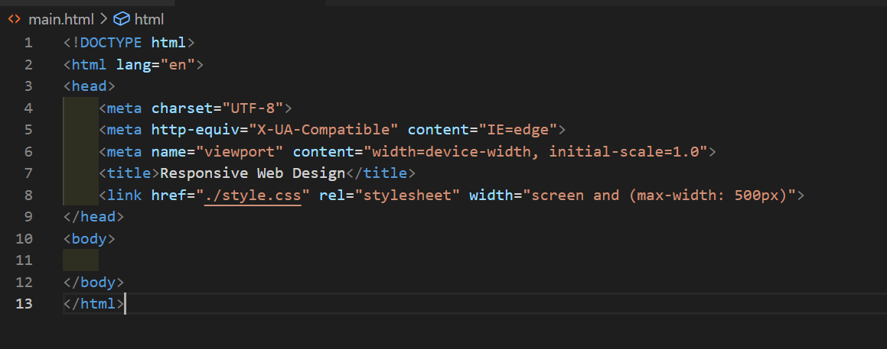
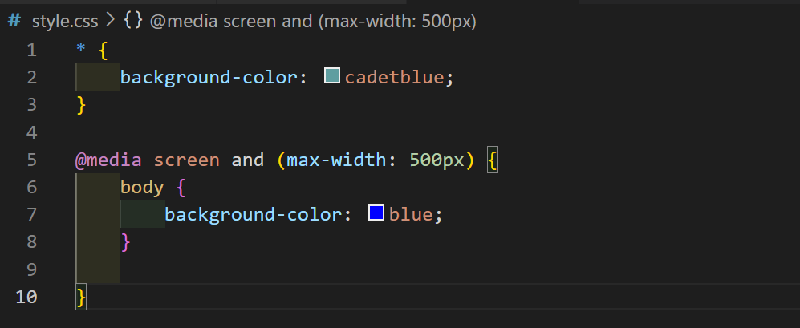

# Writing week 4

## Asynchronous - Fetch dan Async Await

1. Promise adalah dasar dari pemrograman asinkron dalam JavaScript modern. Janji adalah objek yang dikembalikan oleh fungsi asinkron, yang mewakili status operasi saat ini. Pada saat janji dikembalikan ke pemanggil, operasi sering kali belum selesai, tetapi objek janji menyediakan metode untuk menangani keberhasilan atau kegagalan operasi pada akhirnya. Fungsi asinkron memulai operasi dan mengembalikan Promise objek. Anda kemudian dapat melampirkan penangan ke objek janji ini, dan penangan ini akan dieksekusi ketika operasi berhasil atau gagal.
2. Asynchronous - Async-Await merupakan fitur yang hadir sejak ES2017 bekerja dengan cara menunda eksekusi hingga proses asynchronous selesai

3. Asynchronous - Fetch merupakan cara baru dalam melakukan network request yang memanfaatkan sebuah Promise dalam penggunaanya. Karen Fetch mengembalikan sebuah Promise maka respon handling yang digunakan adalah then jika promise mengembalikan resolve dan catch jika promise mengembalikan nilai reject.

4. Penggunaan Asynchronous

   - fetch()API
     ```javascript
     fetch("https://digimon-api.vercel.app/api/digimon")
       .then((result) => result.json())
       .then((result) => {
         console.log(result);
       });
     ```
   - Promise

   ```javascript
   let nonton = (kondisi) => {
     return new Promise((resolve, reject) => {
       if (kondisi == "jalan") {
         resolve("nonton terpenuhi");
       }
       reject("batal nonton");
     });
   };
   ```

   - Promise dengan catch()

   ```javascript
   nonton("jalan")
     .then((result) => {
       console.log(result);
     })
     .catch((err) => {
       console.log(err);
     });
   ```

   - Async Await

   ```javascript
   async function asyncNonton() {
     try {
       let result = await nonton("jalan");
       console.log(result);
     } catch (error) {
       console.log(error);
     }
   }

   asyncNonton();
   ```

5. API dan HTTP Request
   - API : Application programming interface.
   - API sebagai alat untuk berbicra antar perangkat lunak. API dapat digunakan untuk sistem berbasis web,sistem operasi, sistem basis data dan perangkat lunak. `HTTP : Hypertext transfer protocol`
   - HTTP di desain untuk memungkinkan komunikasi antar klien dan server.
   - HTTP berfungsi sebagai protokol Request-Response antara klien dan server.
   - HTTP Request yaitu Keadaan dimana server membaca apa yang dikirimkan oleh client melalui aplikasi web server.
   - HTTP Method : <br>
     - GET digunakan untuk meminta data dari sumber tertentu.
     - POST digunakan untuk mengirim data ke server untuk membuat/memperbarui resource.
     - PUT digunakan untuk mengirim data ke server untuk membuat/memperbarui resource..
     - DELETE untuk menghapus spesifiksi resource

## Responsive Web Design

1. Responsive Web Desin yaitu bertujuab membuat desain website kita dapat diakses dalam device apapun.
2. Chrome Dev Tools merupakan tools pada google chrome yang digunakan sebagai tools Responsive Web Design.
3. Untuk mengakses Chrome Dev Tools yaitu :
   `ctrl + shift + j ctrl + shift + m ,digunakan untuk melihat toggle bar`
4. Media Query sebagai media untuk mengatur dan responsive web design dengan menggunana ``min-width dan max-width. Beberapa styles tergantung pada jenis device
5. Ada dua cara untuk menggunakan media query dengan penggunaan breakpoint pada element styling css : <br>

   - cara 1, dengan menambahkan element Breakpoint pada link device yang ada di html main. <br>
      <br>

   - cara 2, Menggabungkan file 1 file css dan banyak file html. Lalu dalam file css tidak lupa untuk memberikan Breakpoint <br>
      <br>

6. Flexbox bertujuan untuk membuat website yang lebih efisien dalam mengatur, menata dan item pada dalam sebuah wadah bahkan ketika ukurannya tidak diketahui dan/atau dinamis (dengan menggunakan kata "flex").
7. Flexbox properties: <br>

   - Flex direction : menetapkan sumbu utama item, sehingga menentukan arah item fleksibel ditempatkan di wadah fleksibel. <br>
     - Row : Kiri ke kanan
     - Row-Reverse : Kanan ke kiri
     - Column : Atas ke bawah
     - Column-Reverse : Bawah ke atas.
   - Flex Wrap : Secara default, semua item pada flexbox akan mencoba berada dalam satu baris. Maka dengan flex wrap kita dapat mengubah hal tersebut. <br>

     - nowrap : semua item flex akan berada dalam satu baris
     - wrap : item fkex akan membungkus ke beberapa baris, dari atas ke bawah.
     - wrap-reverse :item flex akan membungkus beberapa baris dari bawah ke atas.

   - Flex Flow : cara singkat untuk properti flex-direction dan flex-wrap, yang bersama-sama menentukan sumbu utama dan sumbu silang container flex. Nilai default adalah baris nowrap. Align items contoh :
     - Flex Start :margin tepi cross-start item ditempatkan pada garis cross-start (rata atas) container.
     - Flex End :margin tepi cross-end dari item ditempatkan pada garis cross-end (rata bawah) container.
     - Center :item berpusat pada sumbu silang (ditengah) container.
     - Stretch :peregangan untuk mengisi kontainer (tetap mengutamakan nilai min-width / max-width)
     - Baseline :item sejajar seperti garis dasar text mereka sejajar.
   - Grid merupakan sistem tata letak berbasis dua dimensi. Ada dua jenis yaitu Grid container dan grid item.

## Bootstrap

1. Bootstrap adalah senjata andalan para developer saat menciptakan website.
2. Yang biasa di gunakan sebagai framework HTML, CSS, dan JavaScript yang berfungsi untuk mendesain website responsive dengan cepat dan mudah.
3. Framework open source ini diciptakan pada tahun 2011 oleh Mark Otto dan Jacob Thornton dari Twitter. Itulah kenapa dulunya Bootstrap dinamakan Twitter Blueprint.
4. kegunaan Bootstrap dalam pengembangan website?
   - Menciptakan website Mobile Friendly —Berkat sistem grid, proses membuat website mobile friendly tak akan membutuhkan waktu lama.
   - Memudahkan resize gambar — Cukup dengan menambahkan class .img-responsive ke gambar, maka gambar tersebut akan otomatis di-resize sesuai ukuran layar pengguna.
   - Menambahkan elemen website tanpa ribet — Bootstrap menyediakan berbagai elemen yang bisa langsung Anda gunakan di website. Misalnya, navigasi, menu dropdown, thumbnail, dan sebagainya.
   - Membuat website lebih interaktif — Bootstrap juga memungkinkan Anda menggunakan plugin custom JQuery. Jadi, Anda bisa menambahkan berbagai elemen interaktif ke website dengan mudah. Misalnya, popup, transisi, image carousel, dan sebagainya.
5. Kelebihan dan Kekurangan Bootstrap

   - Kelebihan
     - Ramah untuk Pemula
     - Grid System yang Canggih
     - Kompatibilitas dengan Web Browser Terbaru
     - Bersifat Open-Source
     - Kebebasan Kustomisasi
     - Rutin Diperbarui
     - Tersedia Dokumentasi Lengkap
     - Memiliki Komunitas Besar yang Aktif
   - Kekurangan
     - Elemennya Banyak Digunakan Developer Website Lain
     - Bisa Memperlambat Website
     - Memperlambat Proses Belajar

6. Contoh penggunaan content bootstrap : <br>

   - CSS : bootstrap.min.css, bootstrap-grid.css, dll
   - JS : bootstrap.bundle.js, bootstrap.min.js, dll

7. Komponen Bootstrap sebagian besar dibangun dengan base-modifier nomenclature.Contohnya mengelompokkan beberapa properti kedalam kelas dasar seperti .btn, seperti .btn-primary or .btn-success.

8. Breakpoints merupakan suatu cara yang dilakukan untuk membuat desain responsif dengan mengontrol kapan tata letak yang disesuaikan dengan ukuran perangkat tertentu.
9. Container adalah blok dasar atau pembungkus boostrap yang terdiri dari contain, pad dan align yang menyelaraskan konten website dalam perangkat atau area
   pandang tertentu.
10. Grid System pada bootstrap yang terdiri dari 12 kolom default
11. Grid system pada bootstrap menggunakan container,baris dan kolom untuk menata dan menyelaraskan konten,yang dibangun menggunakan flexbox dan itu sudah responsive.
12. Penggunaan Grid System : <br>

    - .col-xs digunakan untuk mengatur monitor pada handphone.
    - .col-sm digunakan untuk mengatur monitor pada tablet.
    - .col-md digunakan pada monitor komputer berukuran sedang.
    - .col-lg digunakan untuk mengatur grid pada ukuran monitor yang besar.

13. Contoh menggunakan grid pada navbar <br>
    ```javascript
    <nav class="navbar navbar-expand-lg">
      <div class="container">
        <a class="navbar-brand" href="#">
          Logo
        </a>
        <button
          class="navbar-toggler"
          type="button"
          data-bs-toggle="collapse"
          data-bs-target="#navbarSupportedContent"
          aria-controls="navbarSupportedContent"
          aria-expanded="false"
          aria-label="Toggle navigation"
        >
          <span class="navbar-toggler-icon"></span>
        </button>
        <div class="collapse navbar-collapse" id="navbarSupportedContent">
          <form id="form" class="d-flex ms-auto" role="search">
            <input
              id="search"
              class="form-control me-2"
              type="search"
              placeholder="Search"
              aria-label="Search"
            />
          </form>
        </div>
      </div>
    </nav>
    ```

#
