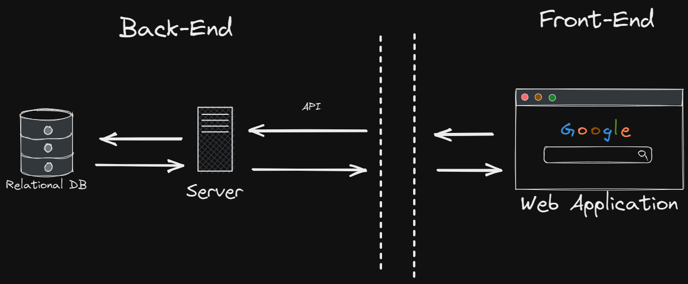
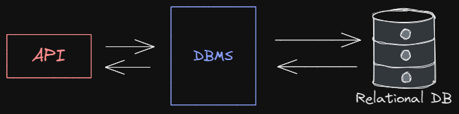

# Writting Test week 6

## Back-End Development

1. Back-End merupakan bagian belakang “layar” dari sebuah website atau aplikasi yang dibuat. Secara teknologi, Back-end adalah segala macam teknologi yang ada di sisi server dari sebuah website atau aplikasi. Ada banyak teknologi Back-end yang berhubungan dengan pengembangan aplikasi web. Contoh di slide selanjutnya.

2. Back-End Developers dapat memilih dari banyaknya bahasa pemrograman dan framework seperti: <br>
   - Java
   - JavaScript
   - C
   - C++
   - Python
   - Golang
   - Rust
3. Peran Back-End dalam mengembangkan web/aplikasi <br> 

4. Server dan database akan dikelola oleh Back-End dengan API sebagai jalur penghubung dengan developers front-end.
5. Server adalah sebuah jaringan komputer yang menyediakan jenis layanan tertentu (service) pada komputer lain.
6. Database dapat didefinisikan sebagai kumpulan data yang disimpan secara sistematis di dalam komputer yang dapat diolah dan dimanipulasi.
7. API adalah sekumpulan instruksi program dan protokol yang digunakan untuk membangun aplikasi perangkat lunak. REST API bertugas sebagai penghubung/perantara antara Front-End dan Back-end untuk saling bertukar informasi(request dan response).

8. MERN adalah salah satu kombinasi teknologi antara front-end dan back-end untuk membuat aplikasi website. MERN adalah singkatan dari MongoDB, Express, React, dan NodeJS. Teknologi Full-stack yang menggunakan 1 bahasa yaitu Javascript sebagai pengembangan.

## Database Introduction

1. Database merupakan sekumpulan tabel yang berisikan informasi untuk diolah yang kemudian data tersebut bisa digunakan di dalam sebuah sistem. Database merupakan sekumpulan tabel yang berisikan informasi untuk diolah yang kemudian data tersebut bisa digunakan di dalam sebuah sistem. Untuk membuat Database diperlukan sebuah software yang dinamakan dengan DBMS(Database Management System).

2. DBMS adalah software yang dapat digunakan oleh user untuk berkomunikasi dengan data yang ada dalam media penyimpanan.
3. ALur DBMS dengan Database <br> 
4. Database memiliki beberapa istilah :<br>
   - Table : Merupakan kumpulan value yang dibangun oleh baris dan kolom, yang didalamnya berisikan atribut dari sebuah data.
   - Field : Merupakan kolom dari sebuah tabel dimana masing-masing field memiliki tipe data masing-masing.
   - Record : Merupakan kumpulan nilai yang saling terkait. Record merupakan isi dari sebuah tabel.
   - SQL(Structured Query Language) : Merupakan suatu bahasa (Language) yang digunakan untuk mengakses database. Bahasa Query yang digunakan untuk melakukan interaksi di RDMS (Relational Database Management System).
5. DDL (Data Definition Language) merupakan kumpulan perintah SQL yang digunakan untuk membuat, mengubah dan menghapus struktur dan definisi metadata dari objek-objek Database.
   - Alter : igunakan untuk mengubah struktur dari tabel yang ada, seperti untuk menambahkan atau menghapus kolom/field. Membuat atau menghapus primary key, mengubah jenis kolom/field yang ada, juga mengubah kolom atau nama tabel.
   - Drop : digunakan untuk menghapus Database, Table, dan View atau Index.
6. DML (Data Manipulation Language) merupakan bahasa basis data yang dipergunakan untuk melakukan modifikasi dan retrieve (pengambilan) data pada suatu basis data.
   - Select : Digunakan untuk menyeleksi data berdasarkan syarat yang diberikan.
   - Insert : digunakan untuk memasukkan data ke kolom-kolom yang terdapat pada tabel/view.
   - Update : digunakan untuk melakukan editing pada isi dari kolom (field) yang dipilih. Hal ini dilakukan untuk memperbaiki data lama / terjadi kesalahan.
   - Delete : Digunakan untuk menghapus data dalam tabel yang menjadi target.
7. DCL (Data Control Language) merupakan pengontrolan terhadap hak user dan pengontrolan terhadap suatu transaksi, apakah akan disimpan secara permanen ke dalam database atau akan dibatalkan.

   - Grant : digunakan untuk memberikan hak akses pada user.
   - Revoke : digunakan untuk mencabut hak akses yang telah diberikan pada user.

8. NoSQL merupakan database yang tidak memiliki perintah SQL. Konsep pernyimpanannya semi struktural atau tidak struktural, dan tidak memiliki relasi layaknya tabel-tabel mySQL. Tujuan dari penggunaan database noSQL adalah untuk model data spesifik dan memiliki skema fleksibel dalam mengembangkan aplikasi modern, contoh: aplikasi yang bersifat real time. Kelebihan menggunakan NoSQL : <br>
   - NoSQL bisa menampung data yang terstruktur, semi terstruktur dan tidak terstruktur.
   - Menggunakan OOP dalam pengaksesan/manipulasi data.
   - NoSQL tidak mengenal schema tabel yang kaku
9. Document merupakan salah satu dari beberapa model database NoSQl. Mendefinisikan database sebagai dokumen artinya penyimpanan data dan proses manipulasinya dalam bentuk objek dokumen. Contoh Objek Dokumen yang sering diterapkan dalam pemrograman adalah format JSON.

## MySQL lanjutan

1. Database Relationships merupaka relasi atau hubungan antara beberapa table dalam bahasa yang kita alami. Lalu relasi antar table dihubungkan dengan PRimary Key dan Foreign Key. Pirmary Key merupakan atribut yang tidak hanya mengidentifikasi secara unik suatu kejadian, tapi juga mewakili setiap kejadian suatu entitas. Foreign Key merupakan atribut yang melengkapi relationship dan menunjukan hubungan antara tabel induk dengan tabel anak.

2. Beberapa tipe database relationships :

   - One to One <br> 
   - One to Many <br> 
   - Many to One <br> 
   - Many to Many <br> 

3. Database Normalization merupakan teknik analisis data yang mengorganisasikan atribut-atribut data dengan cara mengelompokkan sehingga terbentuk entitas yang non-redundant, stabil, dan fleksible.
4. tujuan adanya database Normalization adalah :
   - Menghilangkan redundan data pada database.
   - Memudahkan juka ada perubahan struktur table database.
   - Memperkecil pengaruh jika ada perubahan dari struktur table database.
5. Bentuk Tidak Normal (Unnormalize): Bentuk tidak normal (unnormalized) merupakan kumpulan data yang direkam tidak ada keharusan dengan mengikuti suatu format tertentu.
6. Bentuk - bentuk database Normalization :
   1. 1NF / First Normal Form: 1NF mensyaratkan beberapa kondisi dalam sebuah database, berikut adalah fungsi dari bentuk normal pertama ini.
      - Menghilangkan duplikasi kolom dari tabel yang sama.
      - Buat tabel terpisah untuk masing-masing kelompok data terkait dan mengidentifikasi setiap baris dengan kolom yang unik (primary key).
   1. 2NF: Syarat untuk menerapkan normalisasi bentuk kedua ini adalah data telah dibentuk dalam 1NF, berikut adalah beberapa fungsi normalisasi 2NF.
      - Menghapus beberapa subset data yang ada pada tabel dan menempatkan mereka pada tabel terpisah.
      - Menciptakan hubungan antara tabel baru dan tabel lama dengan menciptakan foreign key.
      - Tidak ada atribut dalam tabel yang secara fungsional bergantung pada candidate key tabel tersebut.
   1. 3NF: Pada 3NF tidak diperkenankan adanya partial “transitive dependency“ dalam sebuah tabel.
      - Transitive dependency biasanya terjadi pada tabel hasil relasi, atau kondisi dimana terdapat tiga atribut A, B, C.
      - Kondisinya adalah A ⇒ B dan B ⇒ C.
      - Maka C dikatakan sebagai transitive dependency terhadap A melalui B.
   1. BCNF Boyce-Codd normal form Merupakan sebuah teknik normalisasi database yang sering disebut 3.5NF, memiliki hubungan yang sangat erat dengan bentuk 3NF. Pada dasarnya adalah untuk menghandle anomali dan overlooping yang tidak dapat di handle dalam bentuk 3NF. Untuk tabel untuk memenuhi Bentuk Normal Boyce-Codd, harus memenuhi dua kondisi berikut:
      - yaitu Table harus dalam Bentuk Normal Ketiga.
      - Dan, untuk ketergantungan apa pun A → B, A harus menjadi super key.
7. Beberapa Key yang ada di SQL :
   1. **Super Key** <br>
      Satu atau lebih atribut yang dapat membedakan setiap baris data dalam sebuah tabel secara unik. Bisa jadi ada lebih dari satu kumpulan atribut yang yang bersifat super key dalam sebuah tabel.
   1. **Candidate Key** <br>
      Merupakan kumpulan atribut minimal yang dapat membedakan setiap baris dalam sebuah tabel secara unik. Sebuah candidate key tidak boleh berisi atribut atau kumpulan atribut yang telah menjadi superkey yang lain,
   1. **Primary Key**<br>
      Primary Key adalah atribut merupakan candidate key yang telah dipilih untuk mengidentifikasi setiap record secara unik. Primary Key harus merupakan atribut yang benar-benar unik dan tidak boleh ada nilai NULL. Primary Key adalah suatu nilai dalam basis data yang digunakan untuk mengidentifikasi suatu baris dalam tabel.
   1. **Foreign Key** <br>
      Jika sebuah primary key terhubungan ke tebel lain, maka keberadaan primary key pada tersbut di sebut sebagai foreign key. Foreign key adalah atribut dalam satu relasi yang digunakan untuk menunjuk ke suatu baris pada relasi yang lain, jadi foreign key ini digunakan untuk membuat sebuah relasi yang trerjadi antara tabel A dengan tabel B, dimana ketika tabel A memebuat sebuah relasi dengan tabel B maka di tabel B primary key tabel A akan menjadi foreign key di tabel B.
   1. **Alternate Key** <br>
      Alternate Key adalah primary key yang tidak terpilih. Misal : dalam suatu entitas terdapat dua atribut yang bisa dijadikan sebagai primary key. Sementara yang boleh dijadikan primary hanya satu, maka kita harus memilih salah satu. Atribut yang dipilih, disebut primary key. sedangkan atribut yang tidak dipilih disebut dengan alternate key.
   1. **Composite Key** <br>
      Composite Key adalah key yang terdiri dari dua atau lebih atribut yang secara unik mengidentifikasi suatu entitas. Setiap atribut yang membentuk key senyawa adalah key sederhana. Composite key terjadi karena dalam sebuah tabel tidak ditemukannya sebuah primary key, jadi agar tidak melakukan pembuatan primary key baru maka dibuatlah sebuah composite key yaitu biasanya merupakan gabungan dari dua buah foreign key, sehingga tidak ada data yang sama yang akan dimunculkan.
8. join Multiple Tables
   1. Inner Join
      - Semua baris akan diambil dari kedua table yang akan di JOIN, selama columns cocok dengan kondisi yang sudah di tentukan.
      - Memungkinkan baris dari salah satu tabel muncul di hasil jika dan hanya jika kedua tabel memenuhi kondisi yang ditentukan dalam klausa ON.
   1. Left Join
      - Pada JOIN ini, semua records dari table di sisi kiri JOIN statement akan di pilih.
      - Jika record yang di pilih dari table kiri tidak memiliki record yang cocok pada table JOIN yang kanan, maka record tersebut masih dipilih, dan kolom pada table yang kanan akan bernilai NULL.
   1. Right Join
      - Pada JOIN ini, semua records dari table di sisi kiri JOIN statement akan di pilih, bahkan jika table di sebelah kiri tidak memiliki record yang cocok.
9. Aggregate Functions
   1. Type of aggregate Functions
      - Max
        fungsi mengembalikan nilai terbesar dari kolom yang dipilih. `SELECT MAX(column_name) FROM table_name WHERE condition;`
      - Min
        fungsi mengembalikan nilai terkecil dari kolom yang dipilih. `SELECT MIN(column_name) FROM table_name WHERE condition;`
      - Sum
        fungsi mengembalikan jumlah total kolom numerik. `SELECT SUM(column_name) FROM table_name WHERE condition;`
      - Count
        fungsi mengembalikan jumlah baris yang cocok dengan kriteria yang ditentukan. `SELECT COUNT(column_name) FROM table_name WHERE condition;`
      - AVG
        fungsi mengembalikan nilai rata-rata kolom numerik. `SELECT AVG(column_name) FROM table_name WHERE condition;`
   1. UNION
      - Digunakan untuk menggabungkan kumpulan hasil dari dua atau lebih pernyataan SELECT.
      - Setiap pernyataan SELECT dalam UNION harus memiliki jumlah kolom yang sam
      - Kolom juga harus memiliki tipe data yang serupa
      - Kolom dalam setiap pernyataan SELECT juga harus dalam urutan yang sama. <br>
      ```sql
       SELECT column_name(s) FROM tablel
       UNION
       SELECT column_name(s) FROM table2;
      ```
   1. GROUP BY
      - Mengelompokkan baris yang memiliki nilai yang sama ke dalam baris ringkasan
      - Sering digunakan dengan fungsi agregat untuk mengelompokkan kumpulan hasil dengan satu atau lebih kolom.
      ```sql
       SELECT column_name(s)
       FROM table_name
       WHERE condition
       GROUP BY column_name(s);
      ```
   1. HAVING
      - HAVING ditambahkan ke SQL karena kata kunci WHERE tidak dapat digunakan dengan aggregate functions.
      ```sql
      SELECT column_name(s)
      FROM table_name
      WHERE condition
      GROUP BY column_name(s)
      HAVING condition
      ORDER BY column_name(s);
      ```
   1. LIKE & Wildcards
      - Operator LIKE digunakan dalam klausa WHERE untuk mencari pola tertentu dalam kolom.
      - Karakter wildcard digunakan untuk menggantikan satu atau lebih karakter dalam sebuah string.
      ```sql
       SELECT column1, column2,..
       FROM table_name
       WHERE columnN LIKE pattern;
      ```
      - Wildcard Characters di SQL
        % Mewakili nol atau lebih karakter. Contoh : %ja% akan cocok dengan belajar, javascript. Lalu jangan mewakili satu karakter. Contoh : m_ster akan cocok dengan master & mister.

## Express JS Middleware Authentication and Authorization

1. Authentication
   Merupakan metode terhadap seorang pengguna mengkonfirmasi sebagai pengguna valid yang dapat mengakses sebuah akun atau informasi tertentu
1. Authorization
   Merupakan proses penentuan terhadap pengguna yang terautentikasi tersebut diizinkan atau ditolak untuk melakukan satu atau lebih akses terhadap sistem.
1. Encryption
   Merupakan proses pengubahan data menjadi format yang tidak bisa dibaca terkecuali apabila ada seseorang yang memiliki kunci untuk mengubah kembali data yang terenkripsi
1. Jenis Autentikasi

   - Single Factor Authentication
     Autentikasi yang sangat sederhana dan banyak digunakan di masa sekarang. Autentikasi ini berupa memasukan sebuah identitas seperti password dan username.
   - Two Factor Authentication
     Autentikasi ini dibuat setelah Single Factor Authentication dipakai yaitu adanya tambahan autentikasi seperti OTP dan sidik jari atau wajah.
   - Multi Factor Authentication
     Autentikasi yang mewajibkan pengguna untuk memverifikasi 3 jenis identitas seperti ID pengguna (password dan username), sidik jari, dan beberapa pertanyaan yang berhubungan dengan pengguna.

1. Membuat Authentication dan Authorization
   Penggunaan `jsonwebtoken` <br>

   ```javascript
   const express = require("express");
   const app = express();

   const PORT = 3000;

   app.use(express.json());

   const users = [
     { id: 1, email: "reza@gmail.com", password: "reza" },
     { id: 2, email: "saputra@gmail.com", password: "saputra" },
   ];

   const KEY = "agsdsdgsda";

   // Proses autentikasi
   app.get("/auth", (req, res) => {
     const { email, password } = req.body;
     const userData = users.find(
       (item) => email === item.email && password === item.password
     );
     const token = jwt.sign(
       {
         id: userData.id,
       },
       KEY
     );

     if (userData) {
       res.json({
         message: "success login",
         token,
       });
     } else {
       res.status(401).json({
         message: "email or password are incorrect",
       });
     }
   });

   // Proses autorisasi
   app.get("/films/:id/subscribe", (req, res) => {
     try {
       const auth = req.headers.authorization;
       const token = auth.split(" ")[1];

       jwt.verify(token, KEY);

       res.json({
         message: "subscribe moviess",
       });
     } catch (error) {
       res.status(500).json({
         message: error.message,
       });
     }
   });

   app.listen(PORT, () => {
     console.log("server running on port ", PORT);
   });
   ```

## Build Web services and RestFul API with Express and Sequelize

1. Sequelize <br>
   Sequelize adalah Node.js promise-based ORM untuk MySQL, PostgreSQL, SQLite, MSSQL dan database SQL lainnya. Sequelize berfungsi untuk bekerja dengan database dan relasi-relasi di dalamnya.
1. ORM<br>
   ORM adalah suatu metode/teknik pemrograman yang digunakan untuk mengkonversi data dari lingkungan bahasa pemrograman berorientasi objek (OOP) dengan lingkungan database relational.
1. Installation Sequelize di node js <br>
   `yarn add sequelize`<br>
   `yarn add sequelize-cli`<br>
   `npx sequelize-cli init`<br>

1. Generate Sequelize

   - Sequelizq init <br>
     kita perlu melakukan inisialisasi di project kita terlebih dahulu agar dapat melakukan generate code. `npm sequelize-cli init`
   - Generate Model <br>
     `npx sequelize-cli model:generate --name Todo --attributes title:string, description: string, startTime:date, status:string` <br>
     `npx sequelize-cli db:migrate`<br>
     `npx sequelize-cli db:migrate:undo`<br>

   - Generate Seed <br>
     Seed adalah data awal yang bisa kita gunakan untuk mengisi data di database untuk keperluan awal project menggunakan sequelize. <br>
     `npx sequelize-cli seed: generate --name demo-todo` <br>
     `npx sequelize-cli db:seed: all`<br>
     `npx sequelize-cli db:seed: undo`
